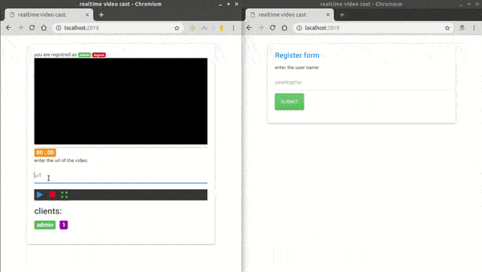

# How to install

clone the project inside your computer
change the port & the admin properties in app.js

```
npm install
npm install typescript
tsc
npm start
```

# Delete all videos:
```
npm run clean
```


# How to use
set admin username & password in the app.js
choose a port in app.js
put your videos in public folder and enter the name of the video in admin mode in url input.
if you want to login as admin, you must enter the username & password of admin inside username input like this pattern: "username:password"


# New changes:
fix video buffering or initial checker problem
add download video button for other clients
more realtime

# Demo:
